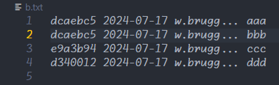
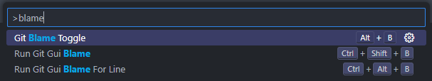
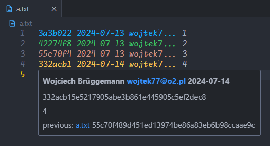
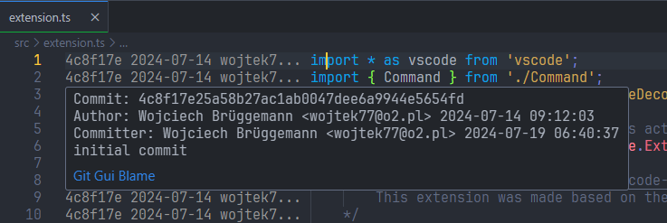
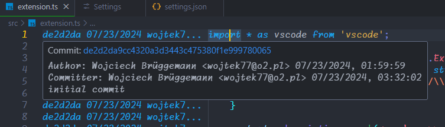
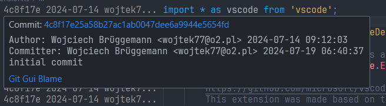
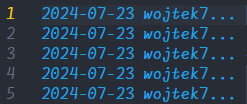

# Git Blame W77

## Description
It is an extension for VS code, which can show git blame in editor and can run git gui blame.

## Features
- High performance.
- Support for very large files (e.g. 20,000 lines of code).
- Show git blame simillar like NetBeans IDE.
- Use resources only when is switch on.
- Possibility to run Git Gui Blame (e.g for check changes in line).
- No library dependencies.

## How to use
1. Press **Alt + B** on the text editor to show or hide the blame decoration
2. To see details of commit hover mouse on the decoration (the option "editor.hover.enabled" have to be enabled)
3. Press **Ctrl + Alt + B** on the text editor to run Git Gui Blame For Line
4. Press **Ctrl + Shift + B** on the text editor to run Git Gui Blame For File





## Commands
| name | description | keybinding |
| - | - | - |
gitBlameW77.toggleBlameDecoration | Toggle Blame Decoration | alt + b
gitBlameW77.runGitGuiBlameForHash | Run Git Gui Blame For Line (hash) | ctrl + alt + b
gitBlameW77.runGitGuiBlameForFile | Run Git Gui Blame For File | ctrl + shift + b

## Configuration
| name | default | description |
| - | - | - |
gitBlameW77.colors | ["#17a7ea", "#43a965", "#ba9286", "#cfa84e", "#bd6ab9", "#8f74e0", "#3187f0", "#e58965", "#e66e84", "#7a82da"] | Specifies colors for the blame decoration.
gitBlameW77.gitBlameUrl | null | Specifies git blame URL e.g 'https://github.com/wojtek77/git-blame-w77/commit/${hash}'. When it is NULL (default) it tries to automatically find the URL. When there is an empty string it disables this functionality. This functionality degrades performance when rendering decorations.
gitBlameW77.dateLocale | "" (empty string) | Specifies locale for date e.g 'en-US'. More locales here https://www.w3schools.com/jsref/jsref_tolocalestring.asp or https://stackoverflow.com/questions/27939773/tolocaledatestring-short-format. When there is an empty string (default) then it take locale from system.
gitBlameW77.decorationShowHash | true | Specifies whether to show commit hash or not in decoration.

### Examples for "gitBlameW77.colors"

```json
    // default colors
    "gitBlameW77.colors": [
        "#17a7ea",
        "#43a965",
        "#ba9286",
        "#cfa84e",
        "#bd6ab9",
        "#8f74e0",
        "#3187f0",
        "#e58965",
        "#e66e84",
        "#7a82da"
    ],

    // gray colors
    "gitBlameW77.colors": [
        "#999",
        "#666"
    ],
    
    // one color "editor.foreground" from theme
    "gitBlameW77.colors": [
    ],
```
### Examples for "gitBlameW77.gitBlameUrl"

```json
    // when it is NULL (default) it tries to automatically find the URL
    "gitBlameW77.gitBlameUrl": null,
    
    // own URL e.g 'https://github.com/wojtek77/git-blame-w77/commit/${hash}'
    // where "${hash}" will be replaced by realy hash
    "gitBlameW77.gitBlameUrl": "https://github.com/wojtek77/git-blame-w77/commit/${hash}",
```


```json
    // when there is an empty string it disables this functionality
    // this functionality degrades performance when rendering decorations
    "gitBlameW77.gitBlameUrl": "",
```


### Examples for "gitBlameW77.dateLocale"

```json
    // when there is an empty string (default) then it take locale from system
    "gitBlameW77.dateLocale": "",
    
    // US English
    // more info https://www.w3schools.com/jsref/jsref_tolocalestring.asp
    "gitBlameW77.dateLocale": "en-US",
```
Locale "en-US"\


Locale "sv-SE"\


### Examples for "gitBlameW77.decorationShowHash"

```json
    // default shows commit hash in decoration
    "gitBlameW77.decorationShowHash": true,
    
    // does not show commit hash in decoration
    "gitBlameW77.decorationShowHash": false,
```
Does not show commit hash in decoration\


## Other
Colors made by [Bluloco Dark Theme](https://marketplace.visualstudio.com/items?itemName=uloco.theme-bluloco-dark) and [Bluloco Dark Muted W77](https://marketplace.visualstudio.com/items?itemName=W77.bluloco-dark-muted-theme-w77)
